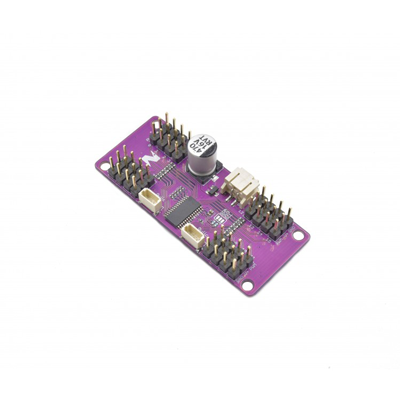

# Qwiic 16 Servo Driver (PCA9685)

> This product can be available for purchase [here](https://www.smart-prototyping.com/Zio-16-Servo-Controller.html).

#### Description

With the Zio 16-Channel 12 bit PWM controller, using the PCA9685 from NXP Semiconductors, you can control up to 16 servos or other PWM-controllable components using I2C.

Each output can be off or on (no PWM control), or set any channel to its own PWM frequency and duty cycle. The PCA9685 operates with a supply voltage range of 2.3v to 5.5v and both the inputs and outputs are 5.5v tolerant. Servos can be connected directly to output pins (up to 25 mA, 5.5v) or controlled with external drivers for more power-hungry applications. 

The board comes equipped with two Qwiic connectors to enable easy daisy-chaining. Need even more channels to control something like a hexapod robot? Quickly and easily connect another servo controller with the additional Qwiic connector and 6 solder-jumper configurable address bits. That means you can have up to 62 of these boards operating on the same I2C bus. You can also configure the boards to recognize group addresses, so that multiple boards can be controlled in parallel with a single command.

This is a derivative of Adafruit’s 16-Channel 12-bit PWM/Servo Driver - I2C interface - PCA9685, with the main difference being the addition of the Qwiic connectors. If you want to make Qwiic a regular part of your hardware hacking/making toolkit (we can’t image why you wouldn’t), this is the Servo Driver for you.

#### Specification

* 62 possible I2C addresses
* Weight: 8.0g (0.278oz)
* Dimension: 59.5x25.2 mm
* IC: PCA9685
* I2C address: 0x40-0x7F (default: 0x40)

#### Links

* [PCA9685 datasheet](https://www.smart-prototyping.com/image/data/NOA-RnD/101896%2016%20Servo%20Controller/PCA9685.pdf)
* [Adafruit PWM Servo Driver Library](https://github.com/adafruit/Adafruit-PWM-Servo-Driver-Library)
* [Example Code](https://www.smart-prototyping.com/image/data/NOA-RnD/101896%2016%20Servo%20Controller/2_servos.ino0)
* [Eagle files](https://github.com/ZIOCC/Qwiic_Servo_Driver_PCA9685)

Connections for Example Code, connecting two servos to the servo driver board. 

> ###### About Zio
> Zio is a new line of open sourced, compact, and grid layout boards, fully integrated for Arduino and Qwiic ecosystem. Designed ideally for wearables, robotics, small-space limitations or other on the go projects. Check out other awesome Zio products [here](https://www.smart-prototyping.com/Zio).
